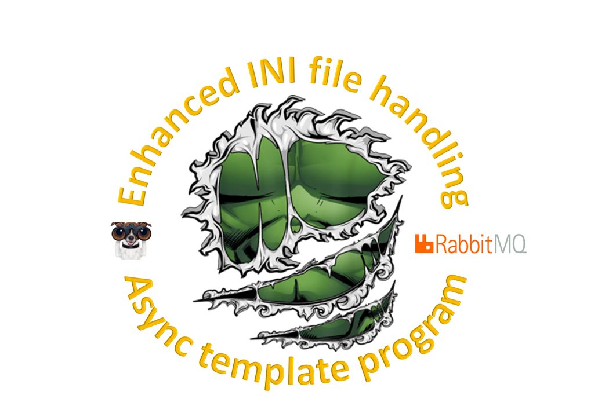

# async_example_program

 An extensive Microservice async program template example

This code repository is an extensive async program example that covers useful building blocks
usable when creating unclouded Microservices on regular servers.

AsyncIO is a vital part of the building blocks, and it is used as much as possible in this example.

I have developed this on Windows, but I also cover Linux and macOS differences where needed.

This repository is described in a number of **Medium** articles.

  

### Here's a brief outline of the article parts

#### [1. Introduction and installation of required components](https://medium.com/@wilde.consult/async-template-program-using-watchdog-rabbitmq-ini-file-deluxe-part1-7e32abf0d417)
This part talks about why a template program is useful when you are working with a distributed system. 
It covers the overall architecture of the example and the installation of required components.

#### [2. Template program example](https://medium.com/@wilde.consult/async-template-program-using-watchdog-rabbitmq-ini-file-deluxe-part2-788042a4c8f1)
This part talks about why a template program is useful when you are working with a distributed system. 
It covers the overall architecture of the example, and we do a code walkthrough of the example program.

#### [3. Template program worker example](https://medium.com/@wilde.consult/async-template-program-using-watchdog-rabbitmq-ini-file-deluxe-part3-d0d6890ea98)
This part dives into the body of the example worker, a genuine code walkthrough.

#### [4. Common program tools not mentioned elsewhere](https://medium.com/@wilde.consult/async-template-program-using-watchdog-rabbitmq-ini-file-deluxe-part4-dce93af95b16)
This part talks about some of the tools that are not mentioned elsewhere.

#### [5. Enhanced INI file handling](https://medium.com/@wilde.consult/async-template-program-using-watchdog-rabbitmq-ini-file-deluxe-part5-a04968d7ee9e)
This part is a walkthrough of the enhanced INI file functionality and how it can be utilized in the system.

#### [6. Watchdog (file system supervision) handling](https://medium.com/@wilde.consult/async-template-program-using-watchdog-rabbitmq-ini-file-deluxe-part6-4992321bc35f)
This part is a walkthrough of the Watchdog functionality and how it can be utilized in the system.

#### [7. RabbitMQ (message broker) handling](https://medium.com/@wilde.consult/async-template-program-using-watchdog-rabbitmq-ini-file-deluxe-part7-83fd142dc60a)
This part is a walkthrough of the RabbitMQ functionality and how it can be utilized in the system. 
